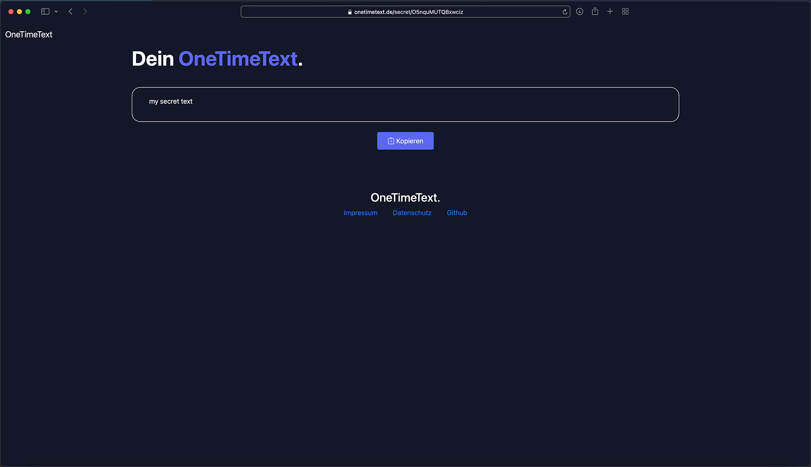

    

# About
OneTimeText is a tool designed to help you send sensitive data, such as passwords, without it showing up in chat or email histories. You can simply wrap the text you want to share with someone in a OneTimeText message and send the link. The text you packaged, which is accessible only through this link, can be read only 1x before the message is deleted from system. So you don't need to worry about other people accessing the secret message.

# Screenshots
Bob wants to share a secret with Alice.

Step 1: Bob enters his secret in the text box and clicks "Create Link"

Step 2: Bob sends the generated link to Alice.

Step 3: Alice opens the link and clicks on "Open OneTimeText".

Step 4: Alice reads the secret message. After Alice has read the message, the message will be destroyed and can not be accessed anymore.

# Installation
## Webspace
- Copy project files to installation folder
- run: composer install
- run: npm install
- create .env from .env.example
- navigate to root directory
- run: php artisan migrate

## Local
- Copy project files to installation folder
- run: composer install
- run: npm install
- create .env from .env.example
- navigate to root directory
- run: php artisan serve
- (optional) if you want to change sass files, run: npm run watch
- run: php artisan migrate
